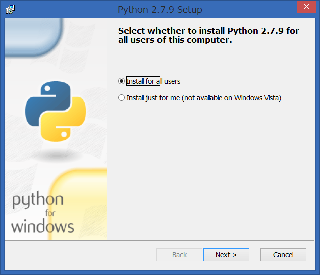

.. _guide-install:

=============================
Pythonをはじめる前に
=============================

:節サブタイトル: Pythonのインストール方法の紹介

Pythonをはじめましょう！

本節ではPythonのインストール方法を紹介します。

.. _python-install:

Pythonのインストール
====================

ここではPythonのインストール方法を説明します。

Linux、OS X、Windows の3 つの環境でのインストール手順を説明します。

Linux （Ubuntu Server） での場合
-------------------------------------

本書では、動作環境 `Ubuntu Server 16.04 <https://wiki.ubuntu.com/XenialXerus/ReleaseNotes>`_ 、
Pythonは3系の最新版3.5.1を想定しています。

ソースビルドでのインストール
^^^^^^^^^^^^^^^^^^^^^^^^^^^^^^^^^

Ubuntu 16.04にソースコードからPython 3.5.1をインストールします（:numref:`package-install`）。

まずパッケージ全体をアップグレードし、Pythonによる開発で必要になるパッケージをインストールします。

.. _package-install:

.. code-block:: bash
    :caption: パッケージの更新と必要なパッケージのインストール

    $ sudo apt-get -y update
    $ sudo apt-get -y upgrade
    $ sudo apt-get -y install build-essential
    $ sudo apt-get -y install libsqlite3-dev
    $ sudo apt-get -y install libreadline6-dev
    $ sudo apt-get -y install libgdbm-dev
    $ sudo apt-get -y install zlib1g-dev
    $ sudo apt-get -y install libbz2-dev
    $ sudo apt-get -y install sqlite3
    $ sudo apt-get -y install tk-dev
    $ sudo apt-get -y install zip
    $ sudo apt-get -y install libssl-dev
    $ sudo apt-get -y install gfortran
    $ sudo apt-get -y install liblapack-dev

.. g++はbuild-essentialsで、opensslは標準で入る。

Pythonのソースコードをビルドし、インストールします（:numref:`python-build`）。

.. _python-build:

.. code-block:: bash
    :caption: Python 3.5.1のソースからのインストール

    $ wget https://www.python.org/ftp/python/3.5.1/Python-3.5.1.tgz
    $ tar axvf ./Python-3.5.1.tgz
    $ cd ./Python-3.5.1/
    $ LDFLAGS="-L/usr/lib/x86_64-linux-gnu" ./configure --with-ensurepip --with-zlib
    $ make
    $ sudo make install

インストールが完了したらPythonのバージョンが3.5.1になっていることを確認します。

インストール直後は、 ``hash -r`` を実行してコマンドのパスを再読み込みします（:numref:`check-version`）。

.. _check-version:

.. code-block:: bash
    :caption: Pythonのバージョン確認

    $ hash -r
    $ python3 -V
    Python 3.5.1
    
最後に、以下のコマンドでpipをインストールします。（ :numref:`install-pip`）

.. _install-pip:

.. code-block:: bash
    :caption: pipのインストール（最後のx.x.xにはインストール時のpipの最新バージョン番号が入ります）

    $ wget https://bootstrap.pypa.io/get-pip.py
    $ sudo python3 get-pip.py
    $ rm get-pip.py
    $ hash -r
    $ pip -V
    pip x.x.x from /usr/local/lib/python3.5/site-packages (python 3.5) 

.. admonition:: コラム: インストール先の指定

   ソースコードのビルドで ``configure`` を実行する際に、 ``--prefix`` オプションを付けるとインストール先のディレクトリを指定できます。

   /opt/python3.5.1 ディレクトリ以下にインストールするには、次のように指定します

    .. code-block:: python
        :caption: prefixオプション付きconfigure

        LDFLAGS="-L/usr/lib/x86_64-linux-gnu" ./configure --prefix=/opt/python3.5.1 --with-ensurepip

OS Xでの場合
-------------------------------------
OS XでPythonを利用する場合は、Pythonの公式サイトで配布されているビルド済みのパッケージをインストールします。

次のページで「Latest Python 3 Release - Python 3.5.1」をクリックすると詳細画面に移動します。64 ビット版（Mac OS X 64-bit/32-bit installer）または32 ビット版（Mac OS X 32-bit i386/PPC installer）をダウンロードしてインストールします。

- `Python Releases for Mac OS X <https://www.python.org/downloads/mac-osx/>`_ 

詳しくはPythonの公式ドキュメントの「 `MacintoshでPythonを使う <http://docs.python.jp/3.5/using/mac.html>`_ 」を参考にしてください。

Windowsでの場合
-------------------------------------

WindowsでPythonを利用する場合は、Pythonの公式サイトで配布されているWindowsインストーラを利用します。

次のページで「Latest Python 3 Release - Python 3.5.1」をクリックすると詳細画面に移動します。64ビット版（Windows x86-64 Installer）または32 ビット版（Windows x86 Installer）をダウンロードし、ウィザードに従ってインストールします（:numref:`windows-install`）。

この時、「Add Python 3.5 to PATH」にチェックを入れておきましょう。自動的に必要な環境変数が設定されます。

- `Python Releases for Windows <https://www.python.org/downloads/windows/>`_

.. _windows-install:

   Python for Windowsのインストール画面

まとめ
=============
本節では、Python のインストール方法を紹介しました。
次節ではFizzBuzzを通じたPythonの特徴、基本、役立つWeb の情報、書籍を紹介します。
