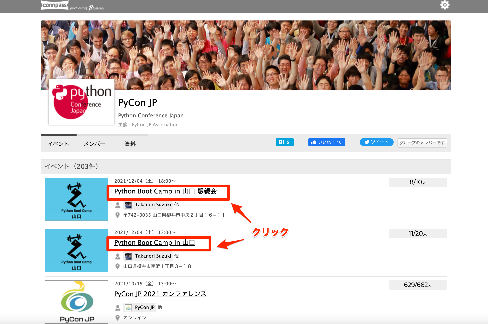
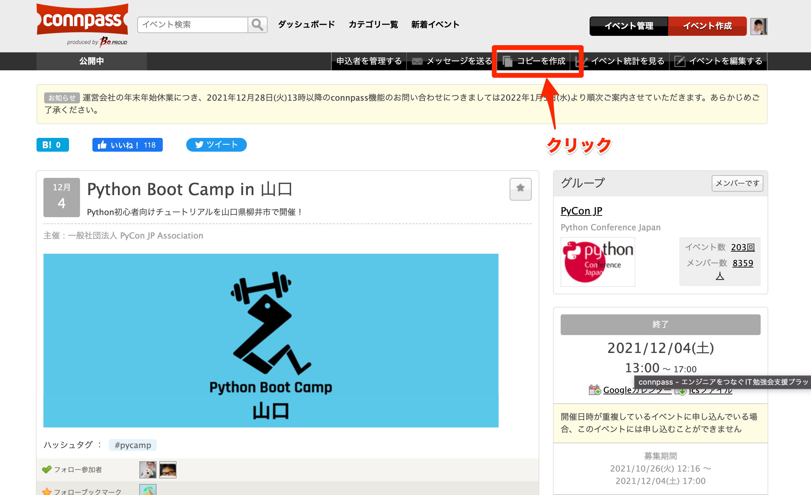
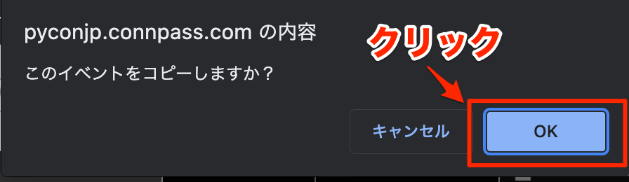
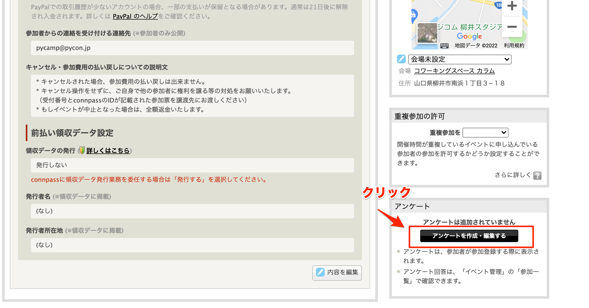
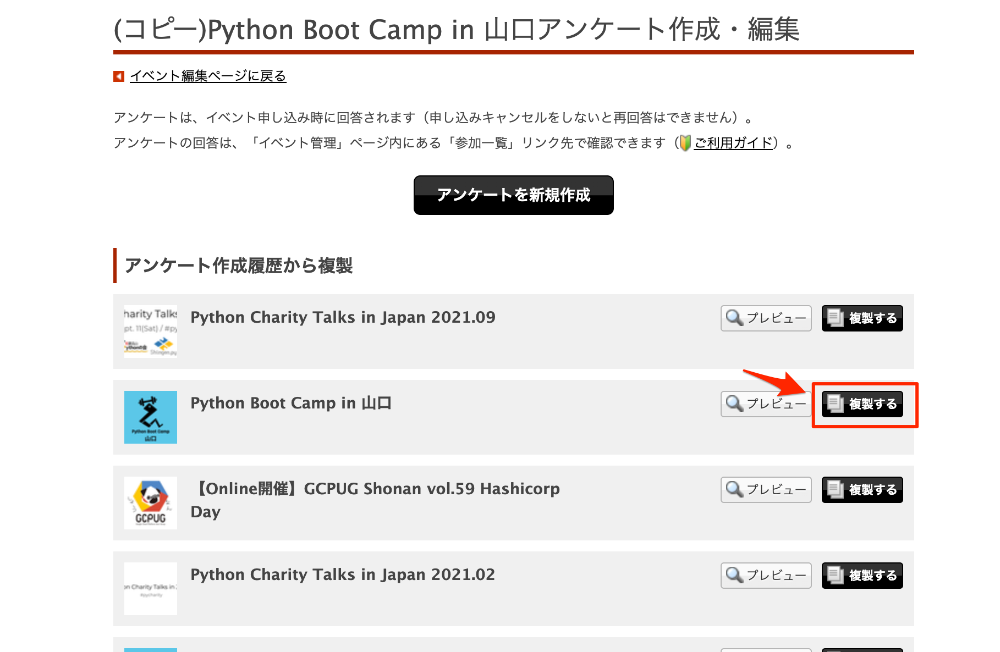
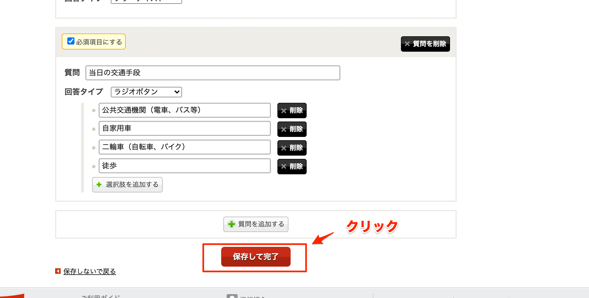

.. _2_corestaff_manual:

######################################
Python Boot Campコアスタッフマニュアル
######################################

Python Boot Camp（略称 PyCamp）コアスタッフがやることについてのマニュアル。

Python Boot Camp全体の運営マニュアルは :ref:`1_manual` を参照すること。

コアスタッフが利用するサービス
==============================

* Slack - pyconjp.slack.com

  * #pycamp チャンネル：Python Boot Camp 全体のチャンネル。全体の運営に関する議論や、講師を募ったり、現地スタッフとのやりとりなどを行う。
  * #pycamp-core チャンネル：コアスタッフ同士での連絡を行うためのチャンネル。
* JIRA: `PyCon JP JIRA <http://pyconjp.atlassian.net>`_ での運営タスク管理。使い方は :ref:`how_to_use_jira` を参照。
* Google Drive共有ドライブ

  * `Python Boot Camp <https://drive.google.com/drive/u/0/folders/0AHeZnmob9mlbUk9PVA>`_；現地スタッフがPython Boot Campに関するドキュメントをアップロードするために利用する。
  * `一社PyCon JP Association <https://drive.google.com/drive/u/0/folders/0AKLhHa9lUV2NUk9PVA>`_：経費精算時に領収書をアップロードするために利用する。

Python Boot Campの開催を立候補した現地スタッフの受け入れ手続き
==============================================================

現地スタッフが `Python Boot Camp 全国ツアーお問い合わせフォーム <https://docs.google.com/forms/d/e/1FAIpQLSedZskvqmwH_cvwOZecI10PA3KX5d-Ui-74aZro_cvCcTZLMw/viewform>`_ を通して開催を立候補すると、 `Zapier <https://zapier.com/>`_ 経由で自動的に以下のタスクが実施される。

* 現地スタッフ受け入れ手続き用JIRAチケット作成

  * 実際に作成されたJIRAチケット：https://pyconjp.atlassian.net/browse/ISSHA-2003

JIRAチケットが作成されたら、Slackの#pycamp-core チャンネルで他のコアスタッフと話し合って、誰がチケットを担当するかを決める。
担当者はJIRAチケット説明の「コアスタッフ担当」に書かれている内容を読んで、現地スタッフ受け入れ手続きを進める。

Python Boot Camp開催決定までに必要なタスク
==========================================

派遣する講師の決定
------------------

コアスタッフは現地スタッフに以下について決めるよう伝える。

* 会場の候補
* 開催候補日

  * 講師の都合上、土曜日のみ候補にすること

決まり次第、Slackの#pycamp チャンネルにて上記の条件で派遣できる講師を決める。 ``@pycamp-instructors`` にメンションを送ることで講師全員に呼びかけることができる。

.. _create_jira_tickets:

JIRAチケットの作成
------------------

JIRAチケットはSlack上の ``$pycamp create`` コマンドを使って作成する。
使い方は ``$pycamp help`` コマンドで確認できる。

作成されるタスクの内容は以下スプレッドシートを参照すること。

https://docs.google.com/spreadsheets/d/1LEtpNewhAFSf_vtkhTsWi6JGs2p-7XHZE8yOshagz0I/edit#gid=1772747731

Google Drive共有ドライブにフォルダを作成
----------------------------------------

以下Google Drive共有ドライブに現地スタッフがドキュメントを置くためのフォルダを作成する。

https://drive.google.com/drive/u/0/folders/0AHeZnmob9mlbUk9PVA

フォルダ名は「開催年月」の後「開催地」を入れること。例えば、2021年5月に山口県で開催する場合は「202105山口」とする。

connpassイベントページ作成手順
------------------------------

connpassイベントページは以下の手順で作成する。

1. PyCon JPグループのイベント一覧（https://pyconjp.connpass.com/event/）から直近の「Python Boot Camp in ○○（地域名が入る）」、「Python Boot Camp in ○○（地域名が入る） 懇親会」というタイトルのイベントを探し、イベントタイトルのリンクをクリックし、イベント編集画面を表示する。

   PyCon JPグループのイベント一覧

2. イベント編集画面の画面上にある「コピーを作成」をクリックする。

   イベント編集画面

3. ダイアログが表示されたら「OK」をクリックし、新しいイベントを作成する。

   「コピーを作成」をクリックすると表示されるダイアログ

4. 新しいイベントにアンケートを作成する。

   新しいイベントページの「アンケートを作成・編集する」をクリック

   コピー元のイベントの右にある「複製する」をクリック

   「保存して完了」をクリック

5. コピーして作成したイベントを編集して、現地スタッフに渡す。具体的な編集内容は :ref:`create_jira_tickets` で作成したチケット「connpassイベント公開(現地スタッフ)]」を参照すること。イベントのロゴは、Slack bot「pyconjpbot」にコマンド ``$pycamp logo (地域)`` を渡して作成する。

Python Boot Campに関する宣伝活動
================================

コアスタッフは開催を立候補する現地スタッフを増やすため、できる範囲で宣伝活動を行う。

宣伝活動の例:

* PyCon JPポスターセッション
* Python関連のイベントでのLT
