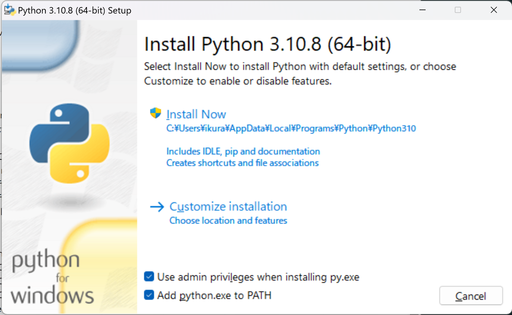

.. _guide-install:

=============================
Pythonをはじめる前に
=============================

:節サブタイトル: エディタ、コマンドラインの準備、Pythonのインストール方法の紹介

Pythonをはじめましょう！

本節では Python Boot Camp の事前準備として以下について説明します。

- ソースコードを読み書きするためのエディタの準備
- Python を実行するためのコマンドラインの準備
- Pythonのインストール方法

エディタの準備
==============
ソースコードを読み書きするために、エディタを用意します。
普段使用しているエディタがある人は、そのエディタを使用して構いません。
Python の文法に対応しているエディタを使用することをおすすめします。

普段使っているエディタがない人は、以下のいずれかをインストールしてください。

- `Atom <https://atom.io/>`_: さまざまなプログラミング言語に対応したエディタ
- `PyCharm <https://www.jetbrains.com/pycharm/>`_: Pythonに特化したIDE(統合開発環境)

コマンドラインの準備
====================
Python をコマンドラインで実行するために、ターミナル、コマンドプロンプトを立ち上げます。

- Mac では「アプリケーション」→「ユーティリティ」→「ターミナル」を選択します
- Windows では **Windows+R** キーを押して ``cmd`` と入力します

.. _python-install:

Pythonのインストール
====================

ここではPythonのインストール方法を説明します。

macOS、Windows、Linuxの3つの環境でのインストール手順を説明します。

macOSの場合
-------------------------------------
macOSでPythonを利用する場合は、Pythonの公式サイトで配布されているビルド済みのパッケージをインストールします。

「 `Python Releases for Mac OS X <https://www.python.org/downloads/mac-osx/>`_ 」をブラウザで開きます。
「 `Mac OS X 64-bit/32-bit installer <https://www.python.org/ftp/python/3.5.3/python-3.5.3-macosx10.6.pkg>`_ 」をダウンロードして実行し、Pythonをインストールします。

詳しくはPythonの公式ドキュメントの「 `MacintoshでPythonを使う <http://docs.python.jp/3.5/using/mac.html>`_ 」を参考にしてください。

Windowsの場合
-------------------------------------

WindowsでPythonを利用する場合は、Pythonの公式サイトで配布されているWindowsインストーラを利用します。

「 `Python Releases for Windows <https://www.python.org/downloads/windows/>`_ 」をブラウザで開きます。
OSによって以下のいずれかのインストーラーをダウンロードし、ウィザードに従ってインストールします。

- 64ビット版: `Windows x86-64 executable installer <https://www.python.org/ftp/python/3.5.3/python-3.5.3-amd64.exe>`_
- 32ビット版: `Windows x86 executable installer <https://www.python.org/ftp/python/3.5.3/python-3.5.3.exe>`_

この時、「Add Python 3.5 to PATH」にチェックを入れておきましょう。自動的に必要な環境変数が設定されます（:numref:`windows-install`）。

.. _windows-install:

   Python for Windowsのインストール画面

Linux （Ubuntu Server） での場合
-------------------------------------

本書では、動作環境 `Ubuntu Server 16.04 <https://wiki.ubuntu.com/XenialXerus/ReleaseNotes>`_ 、
Pythonは3.5系の最新版3.5.3を想定しています。

ソースビルドでのインストール
^^^^^^^^^^^^^^^^^^^^^^^^^^^^^^^^^

Ubuntu 16.04にソースコードからPython 3.5.3をインストールします（:numref:`package-install`）。

まずパッケージ全体をアップグレードし、Pythonによる開発で必要になるパッケージをインストールします。

.. _package-install:

.. code-block:: bash
    :caption: パッケージの更新と必要なパッケージのインストール

    $ sudo apt-get -y update
    $ sudo apt-get -y upgrade
    $ sudo apt-get -y install build-essential
    $ sudo apt-get -y install libsqlite3-dev
    $ sudo apt-get -y install libreadline6-dev
    $ sudo apt-get -y install libgdbm-dev
    $ sudo apt-get -y install zlib1g-dev
    $ sudo apt-get -y install libbz2-dev
    $ sudo apt-get -y install sqlite3
    $ sudo apt-get -y install tk-dev
    $ sudo apt-get -y install zip
    $ sudo apt-get -y install libssl-dev
    $ sudo apt-get -y install gfortran
    $ sudo apt-get -y install liblapack-dev

.. g++はbuild-essentialsで、opensslは標準で入る。

Pythonのソースコードをビルドし、インストールします（:numref:`python-build`）。

.. _python-build:

.. code-block:: bash
    :caption: Python 3.5.3のソースからのインストール

    $ wget https://www.python.org/ftp/python/3.5.3/Python-3.5.3.tgz
    $ tar axvf ./Python-3.5.3.tgz
    $ cd ./Python-3.5.3/
    $ LDFLAGS="-L/usr/lib/x86_64-linux-gnu" ./configure --with-ensurepip
    $ make
    $ sudo make install

インストールが完了したらPythonのバージョンが3.5.3になっていることを確認します。

インストール直後は、 ``hash -r`` を実行してコマンドのパスを再読み込みします（:numref:`check-version`）。

.. _check-version:

.. code-block:: bash
    :caption: Pythonのバージョン確認

    $ hash -r
    $ python3 -V
    Python 3.5.3
    
.. admonition:: コラム: インストール先の指定

   ソースコードのビルドで ``configure`` を実行する際に、 ``--prefix`` オプションを付けるとインストール先のディレクトリを指定できます。

   /opt/python3.5.3 ディレクトリ以下にインストールするには、次のように指定します

    .. code-block:: python
        :caption: prefixオプション付きconfigure

        LDFLAGS="-L/usr/lib/x86_64-linux-gnu" ./configure --prefix=/opt/python3.5.3 --with-ensurepip

まとめ
=============
本節では、事前準備としてエディタ、コマンドラインとPython のインストール方法を紹介しました。
次節ではFizzBuzzを通じたPythonの特徴、基本、役立つWeb の情報、書籍を紹介します。
