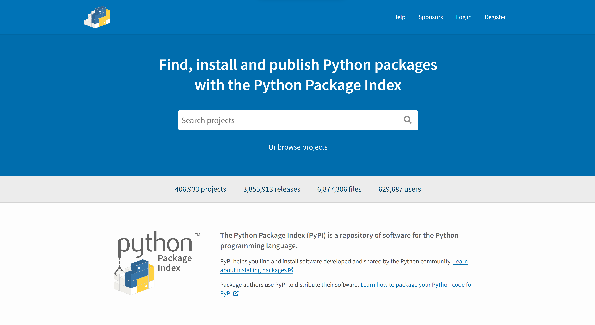

.. -*- coding: utf-8 -*-

.. _venv-section:

=====================================
 サードパーティ製パッケージと venv
=====================================

:節サブタイトル: 隔離されたPythonの実行環境で便利なサードパーティ製パッケージを利用する。

本節では、Pythonをより便利にするサードパーティ製パッケージのインストール方法と、環境を壊さずにインストールするための venv モジュールの使い方を説明します。

サードパーティ製パッケージ
==========================
Python は標準ライブラリだけでもいろいろなことができますが、さらに便利なサードパーティ製のパッケージも提供されています。

サードパーティ製パッケージは `PyPI <https://pypi.python.org>`_ （the Python Package Index、パイピーアイと読む）というサイトで情報が共有されています。

   PyPI - the Python Package Index

pipコマンド
-----------
サードパーティ製パッケージをインストールするには、 **pipコマンド** を使用します。

Python 3.5.1では ``ensurepip`` という仕組みによって、Pythonのインストール時にpipコマンドがインストールされます。

pipもpipコマンドでアップグレードを行えます。まずは、現在イントールされているpipコマンドを最新にアップグレードしましょう。
アップグレードは、次のコマンドを実行します。

.. code-block:: sh
   :caption: pipをアップグレード

   $ sudo pip install pip --upgrade

**以下はpipコマンドのサンプルです** ここでは実行しないで、以下のvenv環境を作ってから実行しましょう。
pip コマンドを利用すると以下の様なコマンドで簡単にサードパーティ製パッケージをインストールできます。

.. code-block:: sh
   :caption: pipコマンドでrequestsをインストール

   $ pip install requests

次に、独立したPython環境を構築する **venv** モジュールについて説明します。

.. admonition:: コラム: Windows環境でpip実行時にエラーになる場合

    PATH環境変数を確認し、Python3 をインストールしているPATHが設定されているかどうか確認してみてください。

venvとは
==========

複数のプロジェクトで異なるサードパーティ製パッケージを利用することはよくあります。その場合、プロジェクトごとにインストールするパッケージを切り替えられると便利です。

venvはプロジェクトごとに隔離されたPython環境を作成します。

.. note:: pyvenvスクリプトについて

 以前は pyvenvスクリプトを利用したPython実行環境の作成方法を紹介していました。

 ですが、Python3.6 から pyvenvスクリプトが非推奨となり将来的に削除されるので一部説明を変更をいたしました。
 今後は「python -m venv」を利用するようにしてください。

 pyvenvスクリプトが廃止になった経緯は下記URLを参照してください。

 https://docs.python.org/dev/whatsnew/3.6.html#id8

venv環境の作成
----------------

venv環境を作成します。

作成には ``venv`` モジュールを使用します。引数には作成する環境の名前を指定します。

.. code-block:: sh
   :caption: venv環境の作成(Linux・Mac・Windows)

    $ python -m venv env

カレントディレクトリに、envというディレクトリが作成されます。

venv環境の有効化
----------------

作成した ``venv`` 環境を有効化（activate）します。

そのためにはbashスクリプトの ``env/bin/activate`` を ``source`` コマンドで実行します（:numref:`venv-activate-linux-or-mac` :numref:`venv-activate-windows` ）。

.. _venv-activate-linux-or-mac:

.. code-block:: sh
   :caption:  venv環境の有効化(Linux・Mac)

    $ source env/bin/activate
    (env)$

.. _venv-activate-windows:

.. code-block:: sh
   :caption:  venv環境の有効化(Windows)

    $ env\Scripts\activate.bat
    (env)$

``venv`` 環境を有効化すると、プロンプトの前に環境名（ここでは ``env`` ）が表示されます。そして、環境変数 ``PATH`` の先頭にenv/binが追加され、 ``venv`` 環境のPythonが実行されるようになります。

ここでは、 ``pip`` コマンドで ``requests`` （HTTPクライアントのパッケージ）をインストールします（:numref:`venv-install-requests`）。

.. _venv-install-requests:

.. code-block:: sh
   :caption: パッケージのインストール

    (env)$ pip install requests
    (env)$ python
    >>> import requests
    >>> # requestsがインポートできる

``requests`` が ``env/lib/python3.5/site-packages`` 配下にインストールされます。

またPythonパッケージの中にはコマンドとして実行可能なファイルが含まれている場合があります。それらのファイルは ``env/bin`` 配下にインストールされます。

venv環境の無効化
------------------
``venv`` 環境を無効化（deactivate）するには、 ``deactivate`` コマンドを実行します（:numref:`venv-deactivate`）。

無効化した後、元の環境で ``requests`` をインポートするとエラーとなり、 ``venv`` 環境でのみ ``requests`` がインストールされていることがわかります。

.. _venv-deactivate:

.. code-block:: sh
   :caption: venv環境を無効化

    (env)$ deactivate
    $
    $ python
    >>> import requests
    Traceback (most recent call last):
     File "<stdin>", line 1, in <module>
    ImportError: No module named requests
    >>> # エラーが出力される

conda の場合
============
`Anaconda <https://www.continuum.io/downloads>`_ を使っている場合は **pip** 、 **venv** の代わりに `Conda <http://conda.pydata.org/docs/>`_ というパッケージ管理ツールを使用します。

condaではそれぞれ以下のコマンドで、サードパーティー製パッケージのインストール、環境の作成、有効化、無効化が行えます。

.. code-block:: sh
   :caption: conda コマンドの例

   $ conda create --name env python # 環境を作成
   $ source activate env # 環境の有効化
   (env) $ conda install requests # パッケージのインストール
   (env) $ source deactivate # 環境の無効化

まとめ
=======

本節では、以下について説明しました。

- 便利なサードパーティ製パッケージのサイト **PyPI**
- パッケージをインストールする **pipコマンド**
- プロジェクトごとに隔離したPython環境を、 **venvモジュール** を使って作成、有効化、無効化する方法

次節では、venv環境にパッケージをインストールして、スクレイピングを行う方法を説明します。
