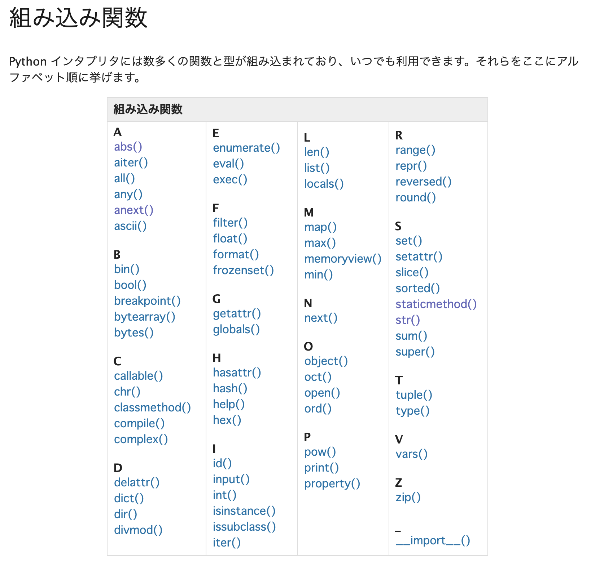

.. index:: Scraping

=========================
 Web API、スクレイピング
=========================

:節サブタイトル: 自動でデータを収集する方法

Web APIとスクレイピングとは
===========================
**Web API** はインターネット上に用意されているAPIをプログラムから呼び出す技術のことです。
**スクレイピング** はウェブサイトから情報を抽出する、コンピュータソフトウェア技術のことをいいます。

ここではPythonを使った実用的なプログラムの例として、Web APIとスクレイピングの演習を行います。

環境構築
========

前章の「 :ref:`about-venv` 」を参考に、venvモジュールを利用して、スクレイピング用のvenv環境を構築します。
venv環境を ``activate`` コマンドで有効にし、Web APIとスクレイピングに使用する **Requests** と **Beautiful Soup 4** を ``pip`` コマンドでインストールします。

.. code-block:: sh
   :caption: 演習用のvenv環境を構築(macOS、Linux)

   $ mkdir scraping
   $ cd scraping
   $ python3 -m venv env
   $ source env/bin/activate
   (env) $ pip install requests
   (env) $ pip install beautifulsoup4

.. code-block:: sh
   :caption: 演習用のvenv環境を構築(Windows)

   > mkdir scraping
   > cd scraping
   > python -m venv env
   > env\Scripts\Activate.ps1
   (env) > pip install requests
   (env) > pip install beautifulsoup4

.. index:: Requests

Requests
--------
:URL: https://requests.readthedocs.io/

Requests について簡単に紹介します。
Requests はウェブサイトにアクセスしてHTMLなどのデータを取得するためのライブラリです。
Pythonの標準ライブラリ `urllib.request <https://docs.python.org/ja/3/library/urllib.request.html>`_ でも同様のことは行なえますが、より便利な Requests をここでは使用します。

.. index:: Beautiful Soup 4

Beautiful Soup 4
----------------
:URL: https://www.crummy.com/software/BeautifulSoup/bs4/doc/

Beautiful Soup 4はHTMLやXMLの中身を解析して、任意の情報を取得するためのライブラリです。
Pythonの標準ライブラリ `html.parser <https://docs.python.org/ja/3/library/html.parser.html>`_ でも同様のことは行なえますが、より便利な Beautiful Soup 4 をここでは使用します。
なお、beautifulsoupとbeautifulsoup4が存在しますが、新しい **beautifulsoup4** を使うようにしてください。

シンプルなWeb APIのコード
=========================
Web APIの例としてconnpassのAPIを実行して、pythonというキーワードを含んだ2018年12月に開催されるイベント情報を取得します。

* `APIリファレンス - connpass <https://connpass.com/about/api/>`_

下記のコードを ``events.py`` という名前で保存します(:numref:`events-py`)。

.. _events-py:

.. code-block:: python
   :caption: events.py

   import requests

   def main():
       params = {
           'keyword': 'python',
           'ym': '201812',
       }
       url = 'https://connpass.com/api/v1/event/'
       r = requests.get(url, params=params)
       event_info = r.json()  # レスポンスのJSONを変換

       print('件数:', event_info['results_returned'])  # 件数を表示
       for event in event_info['events']:
           print(event['title'])
           print(event['started_at'])

   if __name__ == '__main__':
       main()
           
このコードを実行すると、以下のようにイベントタイトルと日付の一覧が取得できます(:numref:`exec-events-py`)。

.. _exec-events-py:

.. code-block:: bash
   :caption: connpass APIを実行

   (env) $ python events.py
   件数: 10
   【超初心者対象】プログラミング未経験者が初心者になるためのPython体験@池袋
   2018-11-28T19:00:00+09:00
   【初心者歓迎】大阪Python もくもく会 #1
   2018-11-16T19:00:00+09:00
   [R]『Ｒ統計解析パーフェクトマスター』１冊丸ごと演習会
   2018-11-23T14:00:00+09:00
   :

コードの解説
------------
上記のコードがどういった内容なのかを解説します。

* Web APIを実行するために ``requests`` をインポートします

.. code-block:: python
   :caption: モジュールのインポート

   import requests

* メインとなる処理を ``main`` 関数として定義しています。 なお、関数の名前に特に決まりはなく、必ずしも ``main`` である必要はありません。

.. code-block:: python
   :caption: main()関数の定義

   def main():

* APIのパラメーターとしてキーワードに ``python`` を、範囲に ``201812`` を指定します。パラメーターを書き換えれば検索条件が変わります。

.. code-block:: python
   :caption: パラメーターを作成

       params = {
           'keyword': 'python',
           'ym': '201812',
       }

* ``requests.get()`` にURLとパラメーターを指定して結果を取得します。
* 結果はJSON形式で返ってくるので、 ``.json()`` メソッドでPythonのデータ型（辞書、リスト等）に変換します。

.. code-block:: python
   :caption: Web APIを実行して結果を取得

       url = 'https://connpass.com/api/v1/event/'
       r = requests.get(url, params=params)
       event_info = r.json()  # レスポンスのJSONを変換

* Pythonデータ型のイベント情報から、件数とイベント名、開催日を取得して出力します。

.. code-block:: python
   :caption: 件数とイベント名、開催日を出力

       print('件数:', event_info['results_returned'])  # 件数を表示
       for event in event_info['events']:
           print(event['title'])
           print(event['started_at'])

* 最後に、このスクリプトが実行された時に、main()関数を実行するように指定します。

.. code-block:: python
   :caption: main()関数を実行

   if __name__ == '__main__':
       main()
   
シンプルなスクレイピングのコード
================================
スクレイピングの例として、docs.python.orgの組み込み関数一覧のページ(https://docs.python.org/ja/3/library/functions.html)から関数名の情報を抜き出します。

   組み込み関数一覧ページ

下記コードを ``simple.py`` という名前で保存します(:numref:`simple-py`)。

.. _simple-py:

.. code-block:: python
   :caption: simple.py

   import requests
   from bs4 import BeautifulSoup

   def main():
       url = 'https://docs.python.org/ja/3/library/functions.html'
       res = requests.get(url)
       content = res.content
       soup = BeautifulSoup(content, 'html.parser')
       functions = soup.find_all('dl', class_='py function')
       print('件数:', len(functions))
       for func in functions:
           func_name = func.dt.code.text

           # 上記記述だと@staticmethodの関数名が正しく取れないので、取りたい場合はこちら
           # func_name = func.dt.find_all('code', class_='sig-name')[0].text

           print(func_name)

   if __name__ == '__main__':
       main()

このコードを実行すると、以下のように関数名の一覧が取得できます(:numref:`exec-simple-py`)。

.. _exec-simple-py:

.. code-block:: bash
   :caption: スクレイピングを実行

   (env) $ python simple.py
   件数: 52
   abs
   aiter
   all
   anext
   any
   ascii
   bin
   breakpoint
   :

.. index:: PEP8

.. admonition:: コラム: Pythonのコーディング規約「PEP8」

    Pythonには `PEP8（ペップエイト） <https://peps.python.org/pep-0008/>`_ というコーディング規約があります。
    チームで開発をする際、人によってプログラムコードの書き方がバラバラだと読みにくいコードになってしまいます。
    そのため、PEP8のルールに従う習慣を身につけておくとよいでしょう。

    コードがPEP8のルールに従っているかは、 `pycodestyle <https://pep8.readthedocs.io/en/latest/>`_ というツールで検証できます(以前はツールの名前もpep8でした)。

    pycodestyleは ``pip install pycodestyle`` でインストールして使用します。
    ``simple.py`` を検証するには、 ``pycodestyle simple.py`` を実行します。

コードの解説
------------
上記のコードがどういった内容なのかを解説します。

* 以下のコードはRequestsとBeautiful Soup 4をimportして利用できるようにしています。

.. code-block:: python
   :caption: モジュールのimport

   import requests
   from bs4 import BeautifulSoup

* メインとなる処理を ``main`` 関数として定義しています。
  なお、関数の名前に特に決まりはなく、必ずしも ``main`` である必要はありません。

.. code-block:: python
   :caption: main()関数の定義

   def main():

* Requestsを使用して、Webページの内容(HTML)を取得します。res.contentにHTMLの中身が文字列データとして入っています。

.. code-block:: python
   :caption: ページの内容を取得

       url = 'https://docs.python.org/ja/3/library/functions.html'
       res = requests.get(url)
       content = res.content

* 次にHTMLをBeautiful Soup 4に渡して解析します。HTMLの解析についてはもう少し詳しく説明します。

.. code-block:: python
   :caption: WebページをBeautiful Soup 4で解析

       soup = BeautifulSoup(content, 'html.parser')
       functions = soup.find_all('dl', class_='py function')
       print('件数:', len(functions))
       for func in functions:
           func_name = func.dt.code.text

           # 上記記述だと@staticmethodの関数名が正しく取れないので、取りたい場合はこちら
           # func_name = func.dt.find_all('code', class_='sig-name')[0].text

           print(func_name)

* 最後に、このスクリプトが実行された時に、main()関数を実行するように指定します。

.. code-block:: python
   :caption: main()関数を実行

   if __name__ == '__main__':
       main()

HTMLの解析の解説
----------------
Beautiful Soup 4でHTMLを解析して、値が取り出せましたが、どのように指定しているのでしょうか?
組み込み関数一覧のHTMLを見てみると、以下のような形式になっています。(:numref:`sponsor-list-html`)

.. _sponsor-list-html:

.. code-block:: html
   :caption: 組み込み関数一覧のHTML
   :emphasize-lines: 1,3,19,21

   <dl class="py function">
       <dt id="abs">
           <code class="sig-name descname">abs</code>
           (<em class="sig-param">
           x</em>
           )
           <a class="headerlink" href="#abs" title="この定義へのパーマリンク">¶</a>
       </dt>
       <dd>
           
数の絶対値を返します。引数は整数、浮動小数点数または 
               <code class="xref py py-meth docutils literal notranslate">
                   __abs__()
               </code>
               が実装されたオブジェクトです。引数が複素数なら、その絶対値 (magnitude) が返されます。
           

       </dd>
   </dl>

   <dl class="py function">
       <dt id="aiter">
           <code class="sig-name descname">aiter</code>
           (
           <em class="sig-param">
               async_iterable
           </em>
           )
           <a class="headerlink" href="#aiter" title="この定義へのパーマリンク">¶</a>
       </dt>
       <dd>
           
:term:
               <a href="#id1">
                   `
               </a>
               asynchronous iterable`から :term:
               <a href="#id3">
                   `
               </a>
               asynchronous iterator`を返します。
               <a href="#id5">
                   ``
               </a>x.__aiter__()``を呼び出すのと等価です。
           

           
なお、:func:
               <a href="#id1">
                   `
               </a>
               iter`とは異なり、:func:
               <a href="#id3">
                   `
               </a>
               aiter`は第二引数を持ちません。
           

           

               

                   バージョン 3.10 で追加.
               

           

       </dd>
   </dl>
   (以下続く)

このHTMLを見ると、関数の名前とURLは以下のようにして取得できそうです。

* 一つの関数の情報は ``<dl class="py function">`` の中に入っている
* 関数名は ``<code class="sig-name descname">`` タグで囲まれた中に入っている

HTMLの構造がわかったところで、もう一度HTMLを解析しているコードを見てみます。

.. index:: html.parser

.. code-block:: python
   :caption: WebページをBeautiful Soup 4で解析

       soup = BeautifulSoup(content, 'html.parser')
       functions = soup.find_all('dl', class_='py function')
       print('件数:', len(functions))
       for func in functions:
           func_name = func.dt.code.text

           # 上記記述だと@staticmethodの関数名が正しく取れないので、取りたい場合はこちら
           # func_name = func.dt.find_all('code', class_='sig-name')[0].text
           
           print(func_name)

まず、 ``soup.find_all()`` メソッドで、全関数の情報が含まれている dl 要素を取得しています。
次に、各関数情報(func変数に入っている)から値を取り出しています。
関数名を取得して、出力しています。

作り変えてみよう
================
RequestsやBeautiful Soup 4の動作を変えて、さまざまなWebページから色んな要素を取得できます。

以下にそれぞれのライブラリの簡単な使い方を紹介します。それ以外にもいろいろな使用方法があるので、ドキュメントを参考にしていろいろ作り変えてみてください。

.. index:: Requests

Requests の主な使い方
---------------------
ここでは Requests の主な使い方の例をいくつか載せます。
詳細については以下の公式ドキュメントを参照してください。

:公式ドキュメント: `Requests: HTTP for Humans <https://requests.readthedocs.io/>`_

以下は認証つきのURLにアクセスして、結果を取得する例です。

.. code-block:: pycon
   :caption: 認証付きURLにアクセスする

   >>> import requests
   >>> r = requests.get('https://api.github.com/user', auth=('user', 'pass'))
   >>> r.status_code
   200

.. index:: Requests
    single: Requests; POST

POST を行う場合は以下のように、POSTのパラメーターを辞書で定義します。

.. code-block:: pycon
   :caption: requests で POST する

   >>> payload = {'key1': 'value1', 'key2': 'value2'} # POST するパラメーター
   >>> r = requests.post('http://httpbin.org/post', data=payload)
   >>> print(r.text)

.. index:: Requests
    single: Requests; GET

GET に ``?key1=value1&key2=value2`` のようなパラメーター付きでアクセスする場合も同様に、辞書で定義します。

.. code-block:: pycon
   :caption: requests でパラメーター付で GET する

   >>> payload = {'key1': 'value1', 'key2': 'value2'}
   >>> r = requests.get('http://httpbin.org/get', params=payload)
   >>> print(r.url)
   http://httpbin.org/get?key2=value2&key1=value1
   >>> payload = {'key1': 'value1', 'key2': ['value2', 'value3']}
   >>> r = requests.get('http://httpbin.org/get', params=payload)
   >>> print(r.url)
   http://httpbin.org/get?key1=value1&key2=value2&key2=value3

Beautiful Soup 4の主な使い方
----------------------------
ここではBeautiful Soup 4の主な使い方の例をいくつか載せます。
詳細については以下の公式ドキュメントを参照してください。

.. index:: Beautiful Soup 4
    single: Beautiful Soup 4; Documentation

:公式ドキュメント: `Beautiful Soup Documentation <https://www.crummy.com/software/BeautifulSoup/bs4/doc/>`_

.. code-block:: pycon
   :caption: Beautiful Soup 4の使用例

   >>> import requests
   >>> from bs4 import BeautifulSoup
   >>> r = requests.get('https://www.python.org/blogs/')
   >>> soup = BeautifulSoup(r.content, 'html.parser') # 取得したHTMLを解析
   >>> soup.title # titleタグの情報を取得
   <title>Our Blogs | Python.org</title>
   >>> soup.title.name
   'title'
   >>> soup.title.string # titleタグの文字列を取得
   'Our Blogs | Python.org'
   >>> soup.a
   <a href="#content" title="Skip to content">Skip to content</a>
   >>> len(soup.find_all('a')) # 全ての a タグを取得しt len() で件数を取得
   164

        url = 'https://www.python.org/news/'
        res = requests.get(url)
        soup = BeautifulSoup(res.content, 'html.parser')

.. index:: find/find_all
    single: Beautiful Soup 4; find()
    single: Beautiful Soup 4; find_all()

また、 ``find()`` ``find_all()`` などでタグを探す場合には、タグの属性などを条件として指定できます。

.. code-block:: pycon
   :caption: find/find_all の使用例

   >>> len(soup.find_all('h1')) # 指定したタグを検索
   3
   >>> len(soup.find_all(['h1', 'h2', 'h3'])) # 複数のタグのいずれかにマッチ
   24
   >>> len(soup.find_all('h3', {'class': 'event-title'})) # <h3 class="event-title"> にマッチ
   5

まとめ
======
本節では、Pythonでスクレイピングをする方法を解説しました。

RequestsとBeautiful Soup 4を使いこなすことにより、さまざまなウェブサイトから情報を取得できるようになります。

なお、短時間にWebサイトに大量にアクセスをすると迷惑となるので、そういうことがないようにプログラムを実行するときには注意してください。

参考書籍
========
Pythonでのスクレイピングについてもいくつか書籍が出ています。

- `PythonによるWebスクレイピング <https://www.oreilly.co.jp/books/9784873117614/>`_
- `Pythonクローリング＆スクレイピング ―データ収集・解析のための実践開発ガイド <https://gihyo.jp/book/2017/978-4-7741-8367-1>`_
- `Pythonによるスクレイピング＆機械学習 開発テクニックBeautifulSoup、scikit-learn、TensorFlowを使ってみよう <https://www.socym.co.jp/book/1079>`_
- `Pythonエンジニア ファーストブック <https://gihyo.jp/book/2017/978-4-7741-9222-2>`_ (第4章 PythonによるWebスクレイピング)
