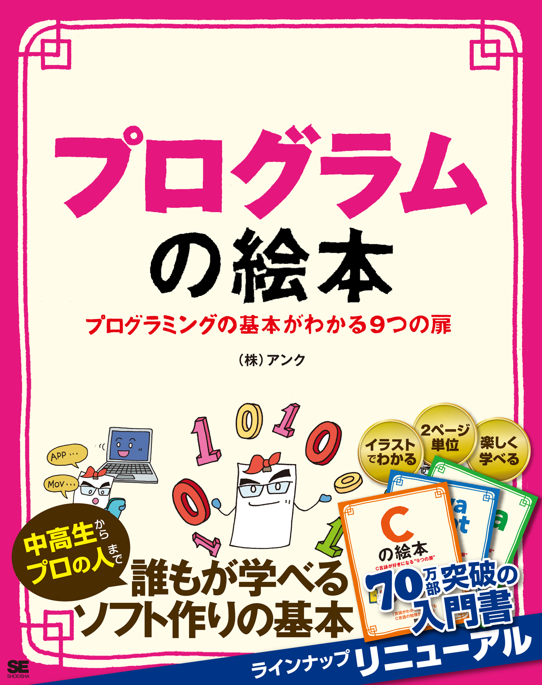
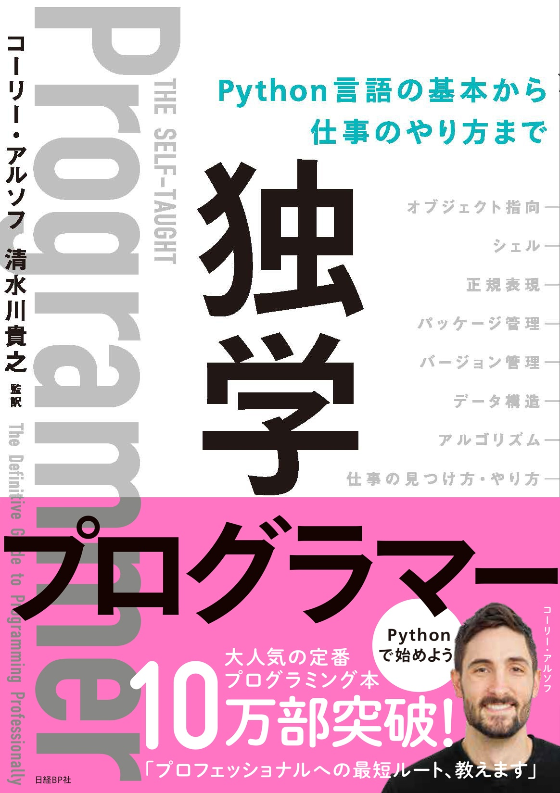
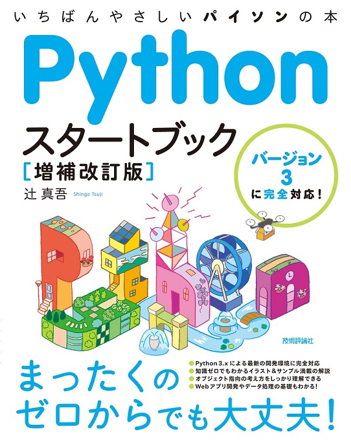
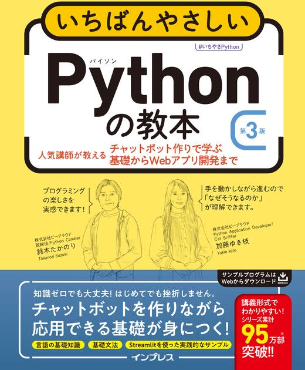
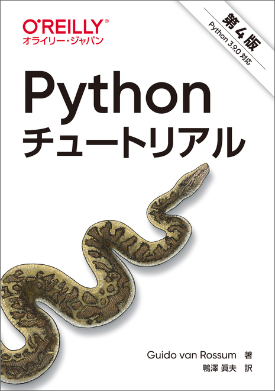
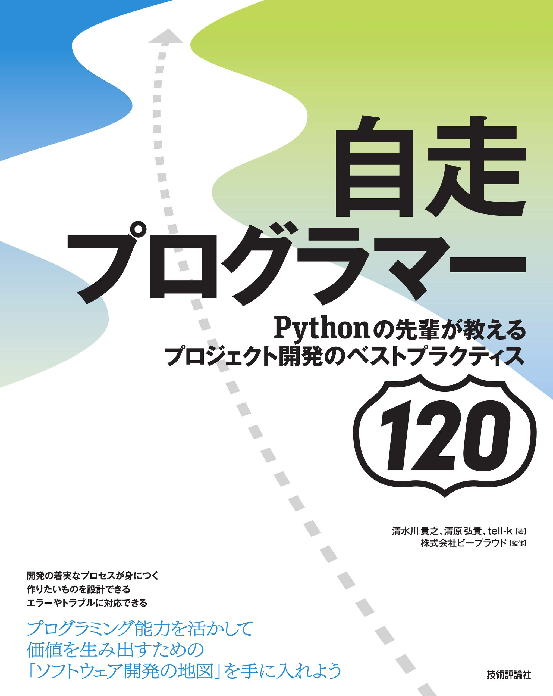
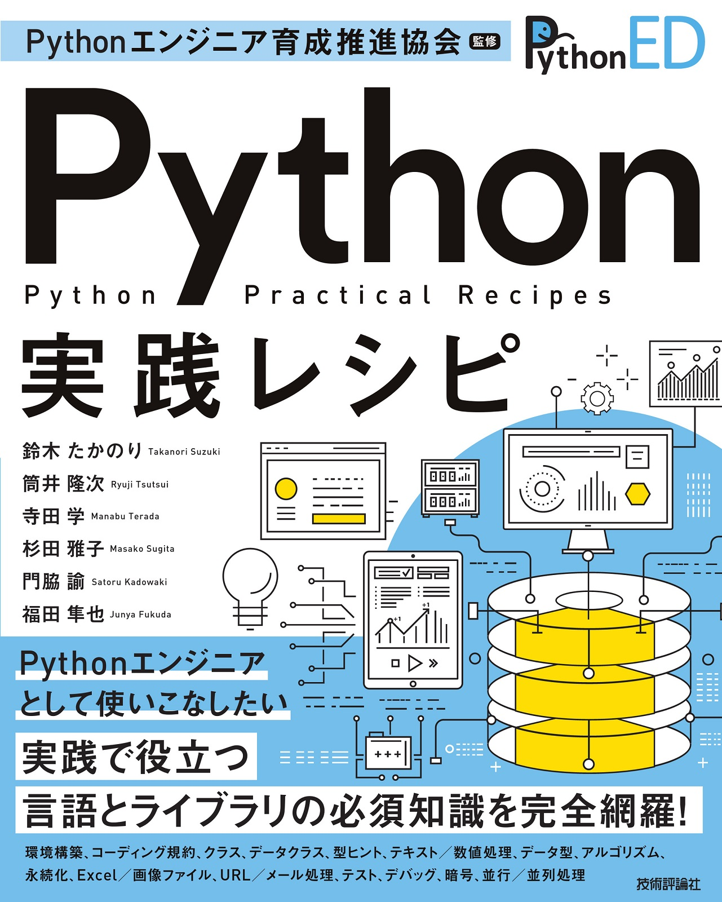

# 次のステップ

ここまでで、Pythonを使った基本的なプログラムの作成方法と、Webスクレイピングについて学びました。

これから、Pythonでのプログラミングを進めていく上で、いろいろとうまく動かない時や、ツールの使い方などの情報が見つからないといったことがあると思います。
ここでは、次のステップに進むにあたって、参考となる情報を載せます。

```{index} Web sites
```

## Webサイト

Pythonの使い方などが解説してあるWebサイト

```{list-table}
* - Python チュートリアル
  - <https://docs.python.org/ja/3/tutorial/>
* - Python 標準ライブラリ
  - <https://docs.python.org/ja/3/library/index.html>
* - Dive into Python 3 日本語版
  - <http://diveintopython3-ja.rdy.jp/>
* - Python HOWTO
  - <https://docs.python.org/ja/3/howto/>
```

```{index} Web sites to learn programming
```

### プログラミング学習

プログラミング学習のためのWebサイト

```{list-table}

* - PyQ : Python学習プラットフォーム
  - <https://pyq.jp/>
* - Paiza : ITエンジニア・プログラマ向けの転職・就活・学習サービス
  - <https://paiza.jp/>
* - ProjectEuler : プログラミングのチャレンジングプラットフォーム
  - <https://projecteuler.net/>
* - CheckIO : Pythonコードを書いてステージを攻略するゲーム
  - <https://checkio.org/>
```

```{index} Q&A web sites for programming
```

### Q&Aサイト

プログラミングについてのQ&Aサイト

```{list-table}
* - Stack Overflow
  - <https://ja.stackoverflow.com/>
* - teratail
  - <https://teratail.com/>
```

### その他

Python プログラムの動作を視覚的に確認できるサイト

- Python Tutor <https://pythontutor.com/>

```{index} Books
```

## 書籍

Pythonやプログラムの学習におすすめの書籍をいくつか紹介します。
上にある書籍が初心者向け、下にある書籍が中、上級者向けです。

```{list-table}
:header-rows: 1
:widths: 15, 20, 60

* - 書影
  - タイトル
  - 内容
* - 
  - [プログラムの絵本](http://www.ank.co.jp/books/data/2016/program_ehon.html)
  - そもそもコンピューターの中で何が起きているのか、から始まる本で、Pythonは登場しません。
    OSの役割、バイナリ、コンパイラ、インタプリタ、アセンブラ、メモリ・・といった、コンピューターの基礎知識を紹介。
    5章ではプログラミング言語の基本要素、条件分岐や繰り返しといった概念を図解で分かりやすく紹介。
* - 
  - [独学プログラマー](https://bookplus.nikkei.com/atcl/catalog/18/C92270/)
  - Pythonを使って「プログラミング全般」の知識を紹介。
	Pythonのインストール方法についてはほとんど触れず、心構えから始まる。
	Pythonの文法の他、Git, Bash, 正規表現, データ構造、アルゴリズム、仕事の仕方、といった全般の知識を広く浅く紹介する、独学者のための地図。
* - 
  - [Pythonスタートブック［増補改訂版］](https://gihyo.jp/book/2018/978-4-7741-9643-5)
  - Python入門を超分かりやすい言葉と絵で丁寧に解説。
    プログラミングの考え方についてはあまり触れていない。
* - 
  - [いちばんやさしいPythonの教本 第2版](https://book.impress.co.jp/books/1119101162)
  - 講義+実習のワークショップ形式の入門書。
    会話bot「pybot」を作りながら、徐々にPython文法の基礎を身に付けていく。
    Pythonのインストール、エディタの使い方、コマンドラインの使い方など、初めてプログラミングに触れる方向けに図を多く使い、手順を分かりやすく紹介している。
* - 
  - [Pythonチュートリアル 第4版](https://www.oreilly.co.jp/books/9784873119359/)
  - Python公式の読み物の書籍版。Web上でも [Python チュートリアル](https://docs.python.org/ja/3/tutorial/index.html) が参照できる。
    リファレンスと異なり、説明を多く書いていて、他の言語経験者であれば十分理解できる。
    このチュートリアルが難しい人は上にある入門書を読むと良さそう。
* - 
  - [自走プログラマー](https://gihyo.jp/book/2020/978-4-297-11197-7)
  - プログラミング入門者が中級者にランクアップするのに必要な知識を、120のトピックで伝える本。
    実際の現場で起こった問題とその解決方法を元に、設計や開発プロセスのベストプラクティスを紹介。
* - 
  - [Python実践レシピ](https://gihyo.jp/book/2022/978-4-297-12576-9)
  - Pythonでプログラムを作成するときに役立つ機能とライブラリを網羅した、実践的なレシピ集。
    環境構築、コーディング規約、言語仕様、クラス、型ヒントなどを解説。
    また、よく使われる標準ライブラリとサードパーティ製ライブラリをサンプルコードと合わせて紹介。
* - 
  - [エキスパートPythonプログラミング 改訂4版](https://store.kadokawa.co.jp/shop/g/g302304004673/)
  - 「Pythonを知っている」状態から「Pythonをマスターしている」状態に成長するための本。Pythonの世界でどのように活動していけばいいのかを知るのに適している。初級中級レベルの話題は扱ってなく、高度な話題や、実践的な情報が満載。
```

```{index} Community
```

## コミュニティ

コミュニティに参加して、仲間を作ることもおすすめです。
みなさんの地域でコミュニティを立ち上げることもおすすめです。

- python.jp: <https://www.python.jp/>
- PyCon JP: <https://pycon.jp>
- Python mini Hack-a-thon: <https://pyhack.connpass.com/>
- PyLadies Tokyo: <https://pyladies-tokyo.connpass.com/>

```{index} pair: Community; slack
```

### コミュニティのチャット

地理的に離れた場所でも、チャットなどを通じてコミュニケーションがとれます。

- pyconjp-fellow.slack.com(PyCon JPに興味のある人達)

  - Python Boot Camp について話す `#pycamp` チャンネルもあります
  - [PyCon JP Fellow Slack招待ページ](https://join.slack.com/t/pyconjp-fellow/shared_invite/zt-p4hb9t0m-CyPNgr7MX16wBqE9y_ZAZA)

- Python.jp Discord

  - [Python.jp Discordサーバ登録ページ](https://www.python.jp/discord/index.html)

- pyhack.slack.com(Python mini Hack-a-thon参加者など)

  - [pyhack Slack招待ページ](https://join.slack.com/t/pyhack/shared_invite/zt-1j3v4er5g-B0QUOjWIa_cc5zVnyDd~ag)

- PyLadies Japan(女性Pythonistaのコミュニティ)

  - [Slackアカウント申請 - PyLadies Japan](https://docs.google.com/forms/d/e/1FAIpQLSelRdBGus7o6MsijTZiTt1kFAoFYQlwYgrBPQOrGVwGlAmHNg/viewform)
